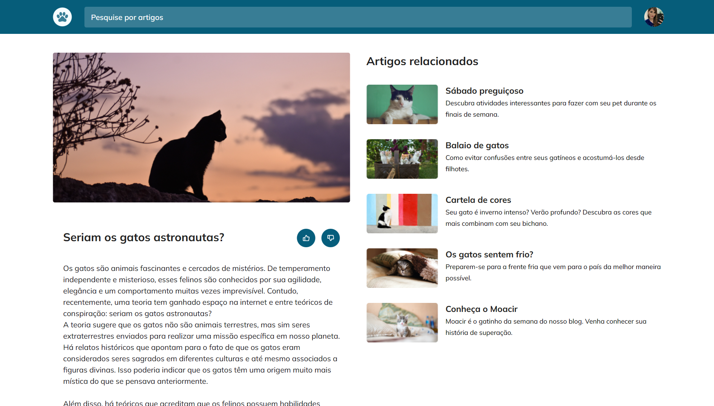

<h1 align="center"> Blog Gatos </h1>

  

 

  

 

## 👾 Tecnologias

Esse projeto foi desenvolvido com as seguintes tecnologias:

- HTML 
- CSS
- Figma
- Git e Github

## 🐱 Projeto

- [Visite o projeto online](https://breseiichi.github.io/blog-gatos/)

## :memo: Licença

Esse projeto está sob a licença MIT.

---

Projeto feito através do Programa Explorer da Rocketseat ♥